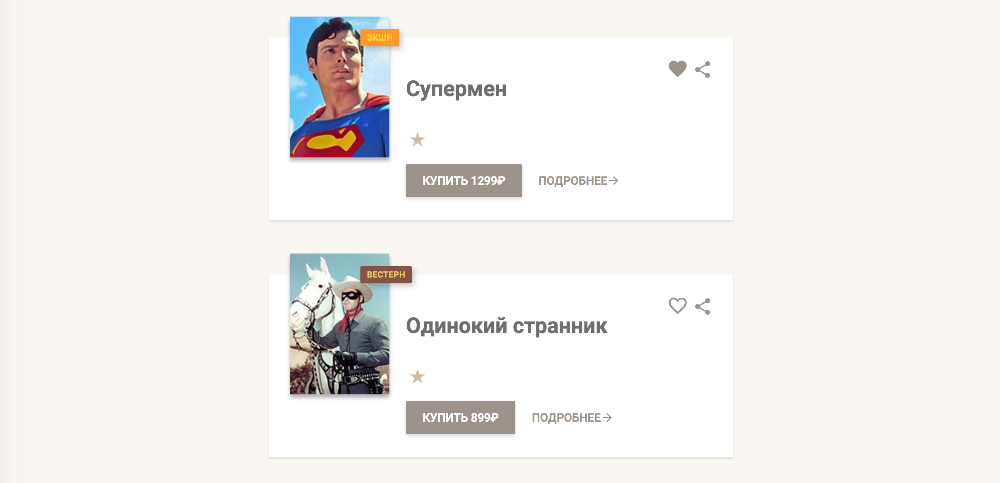
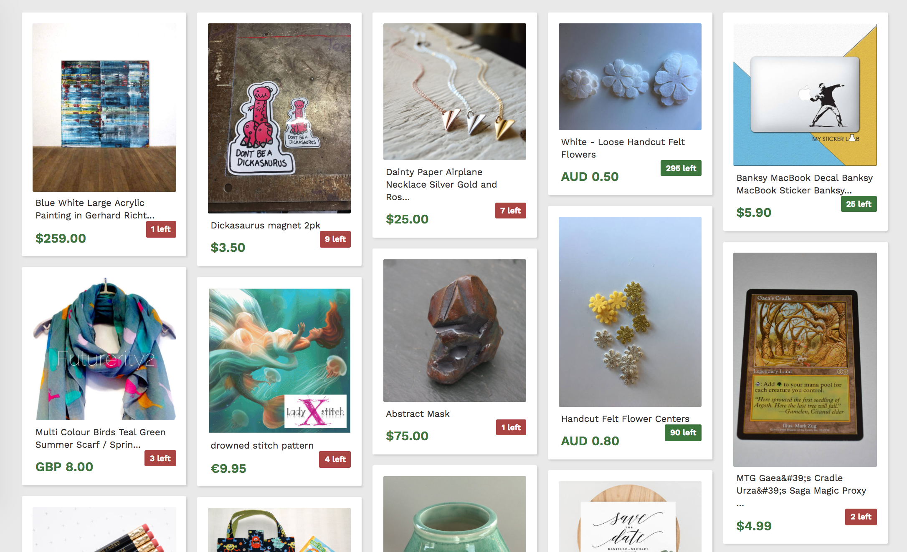

<a name="top"></a>

# 3. Домашнее задание к лекции «Props»

[](https://ci.appveyor.com/project/igor-chazov/ra-hw-3-props-1-2-3) [[GithubPages](https://igor-chazov.github.io/ra-hw-3_props_1-2-3)]

---

**Перейти к:**  
***[3.2 Список предложений](#3.2)  
[3.3 История чата](#3.3)***

---

## 3.1 Рейтинг фильмов

Необходимо реализовать компонент отображающий рейтинг фильма в виде звезд:



## Описание компонента

Для отображения рейтинга создайте компонент `Stars`, который принимает следующие атрибуты:
- `count` — рейтинг фильтам, _число_, по умолчанию `0`.

Если рейтинг меньше `1` или больше `5`, или вообще не число, то компонент не должен иметь какого-либо представления в DOM.

Звезды рейтинга должны быть представлены тегом `<ul>` с классом `card-body-stars`. Для отображения символа звезды внутри тега `<li>` используйте компонент `Star`.

## Пример использования

```jsx
// Внутри App
return (
  <Stars count={1} />,
);
```

Компонент должен дать следующий код:
```html
<ul class="card-body-stars u-clearfix">
  <li>
    <svg fill="#D3BCA2" height="28" viewBox="0 0 18 18" width="28" xmlns="http://www.w3.org/2000/svg">
      <path d="M9 11.3l3.71 2.7-1.42-4.36L15 7h-4.55L9 2.5 7.55 7H3l3.71 2.64L5.29 14z"/>
      <path d="M0 0h18v18H0z" fill="none"/>
    </svg>
  </li>
</ul>
```

## Реализация

Необходимо реализовать компонет `Stars` (не забудьте, что отдельная звезда должна быть представлена компонентом `Star`).

Важно: вам нужно реализовать только отображение звездочек (карточку фильма не нужно).

---

## <a name="3.2">3.2 Список предложений</a>
***[(наверх)](#top)***

Необходимо вывести список предложений каталога Etsy.com, используя библиотеку React. После загрузки данных и отрисовки список должен выглядеть так:


## Данные списка предложений

Данные для списка доступны в формате JSON в каталоге `data`. Вам нужно их скопировать и хранить в виде константы в переменной (для создания JS-объектов используйте `JSON.parse`).

Это _массив объектов_, каждый _объект_ представляет одно предложение. У предложение доступно множество свойств, но в приложении необходимо использовать следующие:
- `listing_id` — уникальный идентификатор предложения, _число_;
- `url` — ссылка на предложение, _строка_;
- `MainImage` — информация об изображении, _объект_, нам необходимо использовать свойство `url_570xN` для получения адреса главной картинки, _строка_;
- `title` — название предложения, _строка_;
- `currency_code` — код валюты, _строка_;
- `price` — цена, _строка_;
- `quantity` — доступное количество, _число_.

## Описание компонента

Для отображения списка создайте компонент `Listing`, который принимает следующие атрибуты:
- `items` — список предложений, _массив объектов_, по умолчанию пустой массив.

Компонент должен создавать на основе списка предложений следующий HTML-код:
```html
<div class="item-list">
  <div class="item">
    <div class="item-image">
      <a href="https://www.etsy.com/listing/292754135/woodland-fairy">
        
      </a>
    </div>
    <div class="item-details">
      <p class="item-title">Woodland Fairy</p>
      <p class="item-price">$3.99</p>
      <p class="item-quantity level-medium">12 left</p>
    </div>
  </div>
</div>
```

Если название предложения привышает `50` символов, то необходимо выводить только первые `50` символов, и добавлять символ `…` в конце.

При выводе стоимости предложения необходимо учитывать валюту. Если цена задана:
- в долларах США, код `USD`, то цену вывести в формате `$50.00`;
- в евро, код `EUR`, то цену вывести в формате `€50.00`;
- в остальных случаях цену вывести в формате `50.00 GBP`, где `GBP` — код валюты.

Вывести остаток, подсветив его в зависимости от количества, используя класс `level-*`:
- `level-low` — если остаток меньше `10` включительно,
- `level-medium` — если остаток меньше `20` включительно,
- `level-high` — если остаток больше `20`.

## Реализация

Необходимо отобразить данные списка предложений, используя компонент `Listing`.

Используйте приложенный css-файл для стилизации.

---

## <a name="3.3">3.3 История чата</a>
***[(наверх)](#top)***

Необходимо реализовать один из компонентов чата — историю сообщений:


## Данные

Список сообщений, передаваемый в компонент, представляет собой _массив объектов_, каждый из которых представляет собой сообщение, которое необходимо отразить в истории. Сообщение имеет следующие свойства:
- `id` — уникальный идентификатор сообщения, _строка_;
- `from` — автор сообщения, _объект_;
- `type` — тип сообщения, _строка_, варианты значений: `response`, `message`, `typing`;
- `time` — время публикации сообщения, _строка_;
- `text` — текст сообщения, _строка_, может отсутствовать.

## Описание компонента

Для отображения списка создайте компонент `MessageHistory`, который принимает следующие атрибуты:
- `list` — список сообщений, _массив объектов_, по умолчанию пустой массив.

Если список сообщений пуст, то компонент не должен иметь какого-либо представления в DOM.

Компонент должен создавать на основе списка предложений следующий HTML-код:
```html
<ul>
  <li class="clearfix">
    <div class="message-data align-right">
      <span class="message-data-time">10:10</span> &nbsp; &nbsp;
      <span class="message-data-name">Ольга</span>
      <i class="fa fa-circle me"></i>
    </div>
    <div class="message other-message float-right">
      Привет, Виктор. Как дела? Как идет работа над проектом?
    </div>
  </li>
  <li>
    <div class="message-data">
      <span class="message-data-name"><i class="fa fa-circle online"></i> Виктор</span>
      <span class="message-data-time">10:12</span>
    </div>
    <div class="message my-message">
      Привет. Давай сегодня созвонимся. Проект практически готов, и у меня есть что показать.
    </div>
  </li>
  <!-- … и так далее -->
</ul>
```

Где каждый тег `<li>` — сообщение из массива. Для отображения сообщений в чате необходимо использовать следующие компоненты:
- `Message` — если тип сообщения равен `message`,
- `Response` — если тип сообщения равен `response`,
- `Typing` — если тип сообщения равен `typing`.

Все три компонента принимают следующие аргументы:
- `from` — автор сообщения, _объект_,
- `message` — сообщение, _объект_.

## Пример использования

```jsx
const messages = [{
  id: 'chat-5-1090',
  from: { name: 'Ольга' },
  type: 'response',
  time: '10:10',
  text: 'Привет, Виктор. Как дела? Как идет работа над проектом?'
}];

// в компоненте App:
return (
  <div className="clearfix container">
    <div className="chat">
      <div className="chat-history">
        <MessageHistory list={messages} />
      </div>
    </div>  
  </div>
);
```

Данные для сообщений:
```js
const messages = [{
  id: 'chat-5-1090',
  from: { name: 'Ольга' },
  type: 'response',
  time: '10:10',
  text: 'Привет, Виктор. Как дела? Как идет работа над проектом?'
}, {
  id: 'chat-5-1091',
  from: { name: 'Виктор' },
  type: 'message',
  time: '10:12',
  text: 'Привет. Давай сегодня созвонимся. Проект практически готов, и у меня есть что показать.'
}, {
  id: 'chat-5-1092',
  from: { name: 'Ольга' },
  type: 'response',
  time: '10:14',
  text: 'Не уверена что сегодня получится. Не все еще в офисе. Давай уточню через час. Возникли ли какие-либо проблемы на последней стадии проекта?'
}, {
  id: 'chat-5-1093',
  from: { name: 'Виктор' },
  type: 'message',
  time: '10:20',
  text: 'Нет, все прошло гладко. Очень хочу показать всё команде.'
}, {
  id: 'chat-5-1094',
  from: { name: 'Виктор' },
  type: 'typing',
  time: '10:31'
}];
```

## Реализация

Необходимо реализовать компонет `MessageHistory`. Важно: вам нужно реализовать только список истории (аватарки и боковую панель реализовывать не нужно).

Используйте файл из каталога css для стилизации.

---

